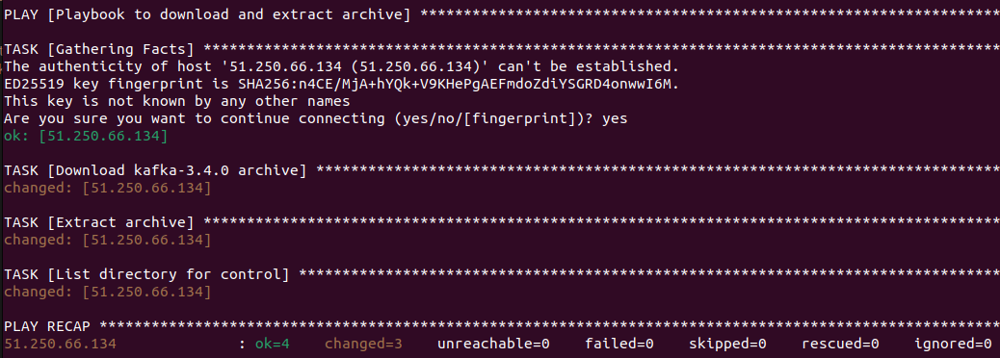
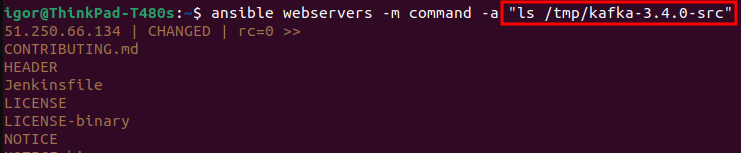
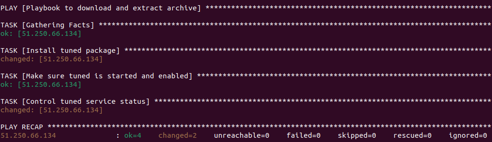
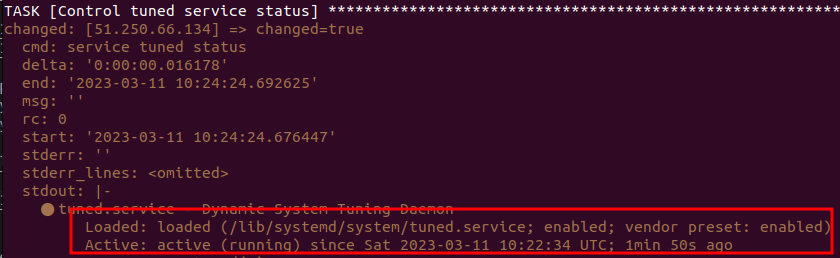
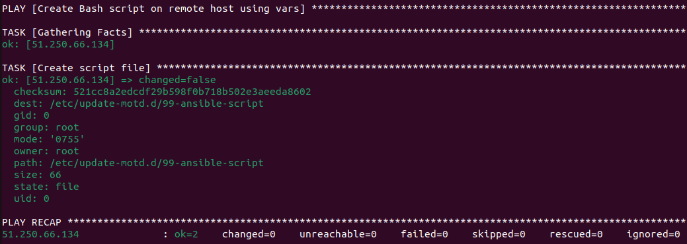
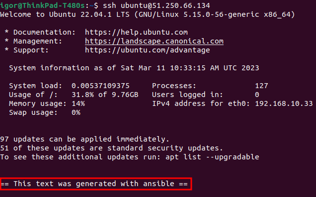
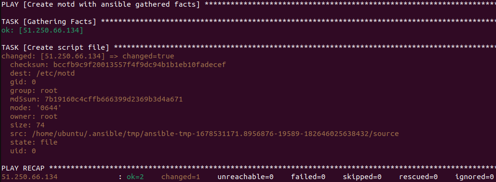
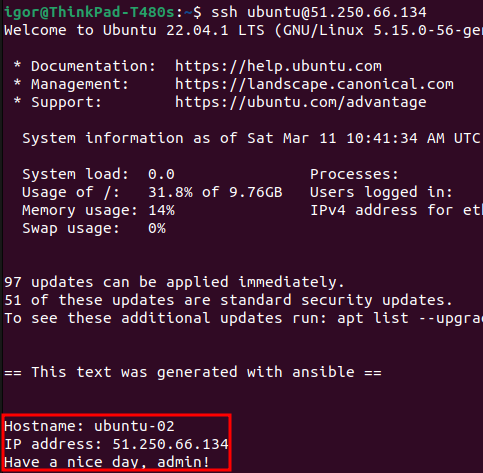
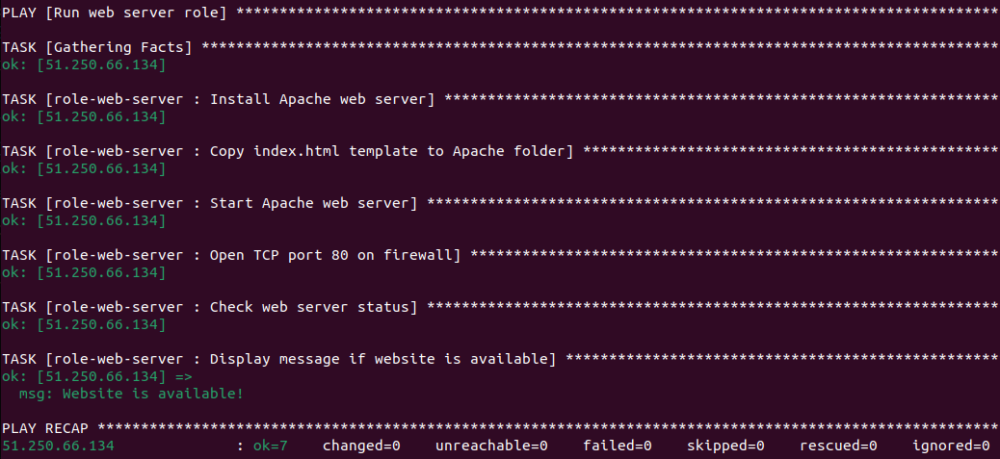
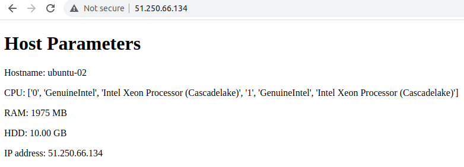

# Домашнее задание к занятию "7.2. Ansible. Часть 2" - Кулагин Игорь
## Задание 1
>Выполните действия, приложите файлы с плейбуками и вывод выполнения.

>Напишите три плейбука. 

>Скачать какой-либо архив, создать папку для распаковки и распаковать скаченный архив.

[Ссылка на playbook](ansible-playbooks/playbook-7.1.2-1.1.yaml)

---

>Установить пакет tuned из стандартного репозитория вашей ОС. Запустить его, как демон — конфигурационный файл systemd появится автоматически при установке. Добавить tuned в автозагрузку.

- [Ссылка на playbook](ansible-playbooks/playbook-7.1.2-1.2.yaml)

---

>Изменить приветствие системы (motd) при входе на любое другое. Пожалуйста, в этом задании используйте переменную для задания приветствия. Переменную можно задавать любым удобным способом.

- [Ссылка на playbook](ansible-playbooks/playbook-7.1.2-1.3.yaml)

---

## Задание 2
>Модифицируйте плейбук из пункта 3, задания 1. В качестве приветствия он должен установить IP-адрес и hostname управляемого хоста, пожелание хорошего дня системному администратору.

[Ссылка на playbook](ansible-playbooks/playbook-7.1.2-2.yaml)

---

## Задание 3
>Создайте плейбук, который будет включать в себя одну, созданную вами роль. Роль должна:

>Установить веб-сервер Apache на управляемые хосты.
>Сконфигурировать файл index.html c выводом характеристик для каждого компьютера. Необходимо включить CPU, RAM, величину первого HDD, IP-адрес. Используйте Ansible facts и jinja2-template
>Открыть порт 80, если необходимо, запустить сервер и добавить его в автозагрузку.
>Сделать проверку доступности веб-сайта (ответ 200, модуль uri).

- [Ссылка на playbook](ansible-playbooks/playbook-7.1.2-2.yaml)

- [Ссылка на роль role-web-server](ansible-playbooks/roles/role-web-server/)

---
